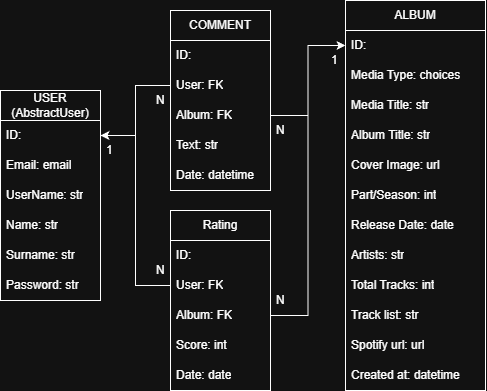

# 🎵 Frisson Music

**Frisson Music** is a community-driven OST hub for discovering, rating, and discussing soundtracks from movies, series, anime, and games.

The main goal of the project is to solve a common problem: **lack of structured and accurate OST-to-media mapping**.  
Here, albums are clearly linked to media, seasons, parts, and release context — and maintained collaboratively by the community.

---

## 🌍 Deployed Application

Live version of the project available here:  

-  https://frisson-music.onrender.com

---

## 🚀 Features

- Browse OST albums by:
  - Media type (Movie / Series / Anime / Game)
  - Specific media title
- Search albums by title
- Rate albums using a 1–5 star system
- View:
  - Average album rating
  - Your personal rating
- Leave comments on albums
- Pagination for large album lists
- Dark-themed UI based on **Black Dashboard**
- Fully responsive layout (desktop & mobile)
- Community-driven moderation:
  - Users can suggest edits
  - Incorrect or misleading data may result in account suspension

---

## 🧠 Project Philosophy

Frisson Music is built around **community trust and data accuracy**.

Instead of chaotic OST dumps, the platform enforces a structured hierarchy:

Media → Seasons / Parts → OST Albums → Tracks

This allows users to:
- Clearly understand where an OST belongs
- Avoid duplicated or incorrectly labeled albums
- Maintain high-quality metadata over time

---

## 🛠 Tech Stack

- **Backend:** Django
- **Database:**  
  - SQLite (development)  
  - PostgreSQL / MySQL (production)
- **Frontend:**  
  - Bootstrap  
  - Custom CSS  
  - JavaScript (interactive rating stars)
- **UI Template:**  
  - Black Dashboard (Creative Tim)
- **Static files:**  
  - CSS, JS, icons, images stored in `static/`
- **Templates:**  
  - Django templates

---

## 🔌 Spotify API Integration

The project supports optional database population via **Spotify API**.

### Populate Database

- Edit `populate_db.py` file to use your own search parameters
1. Configure Spotify credentials
2. Edit search parameters inside:

- Use `python populate_db.py` command to run script (bash)

---

## Test Users

- superuser `mine@gmail.com` `qqq333qqq`
- other `test@gmail.com` `poiuy098`

---

## 📦 Installation (Development)

- `git clone https://github.com/your-username/frisson_music.git`
- `cd frisson_music`
- `python -m venv venv`
- `source venv/bin/activate`  # Windows: `venv\Scripts\activate`
- `pip install -r requirements.txt`
- `python manage.py migrate`
- `python manage.py runserver`

---

## UI Template

- https://demos.creative-tim.com/black-dashboard/examples/dashboard.html

---

## Data Base Diagram

